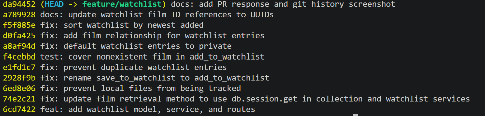

# PR Response Doc — CineLog Watchlist Feature

## AI Usage

I used ChatGPT as a learning and review tool throughout this project. I used it to understand the responsibilities of `models.py`, the collection and watchlist service files, the route layer, pytest fixtures, and the existing deduplication pattern before making changes.

I also used ChatGPT to help me understand Git commands, rebasing, conflict markers, interactive rebase, conventional commit messages, and how to verify that no merge commits remained.

For Comments 4 and 5, I used AI to help identify the tradeoffs between public and private visibility and between alphabetical and newest-first sorting. The final decisions were my own. I chose private-by-default to prioritize user control and newest-added-first to prioritize recent activity. I verified all changes against the actual CineLog code and test results.

## Comment 1 — Rename

**What I did:**  
Renamed `save_to_watchlist()` to `add_to_watchlist()` in `services/watchlist_service.py`. I also updated the import and function call in `routes/watchlist/watchlist.py` so every call site uses the new name. This follows the existing `add_to_collection()` verb-to-noun naming pattern.

**How I verified:**  
I used `git grep` to find all three references before making the change. After renaming, I confirmed that `save_to_watchlist` no longer appeared in the tracked files and that `add_to_watchlist` appeared in the function definition, route import, and route call. I also ran `pytest tests/ -v`, and all four existing tests passed.

## Comment 2 — Deduplication

**What I did:**  
Added an `AlreadyInWatchlistError` and updated `add_to_watchlist()` to search for an existing `WatchlistEntry` with the same `user_id` and `film_id`. If a matching entry exists, the function raises the new error before creating another database row. I followed the same query-and-error pattern used by `add_to_collection()`.

**How I verified:**  
I ran the existing test suite with `pytest tests/ -v`, and all tests passed. I also used a temporary in-memory database to add the same film twice. The second call raised `AlreadyInWatchlistError`, and the database count confirmed that only one matching watchlist entry existed.

## Comment 3 — Missing test

**What I did:**  
Created `tests/test_watchlist.py` and added `test_add_to_watchlist_nonexistent_film_raises`. The test creates a valid user, uses a film ID that does not exist in the database, and verifies that `add_to_watchlist()` raises `FilmNotFoundError`. I followed the fixture and assertion pattern from `test_add_to_collection_nonexistent_film_raises`.

**How I verified:**  
I ran the new test file directly:

```powershell
pytest tests/test_watchlist.py -v
```

I then ran the complete test suite:

```powershell
pytest tests/ -v
```

All five collection and watchlist tests passed together.

## Comment 4 — Default visibility

**My position:**  
Watchlist entries should be private by default, so I changed the model default from `public=True` to `public=False`.

**Reasoning:**  
A user's watchlist can reveal personal interests and future viewing plans. I do not think that information should be shared automatically because the user did not notice or change a default setting. Making entries private by default gives users more control and requires an intentional decision before their watchlist becomes visible to others.

**Tradeoff acknowledged:**  
A private default makes CineLog slightly less convenient as a social-discovery platform because users must take an additional step before sharing their watchlists. However, I believe protecting user privacy by default is more important than automatically maximizing visibility.

I verified the behavior with a temporary in-memory database. A newly created watchlist entry returned `public=False`, and the full test suite continued to pass.

## Comment 5 — Sort order

**My position:**  
I accepted the reviewer's suggestion and changed the default watchlist order from alphabetical to newest-added-first.

**Reasoning:**  
A watchlist records films that a user is considering watching, so recent additions are likely to be the most relevant. Showing the newest entries first helps users quickly find films they recently saved. It also makes the watchlist behavior consistent with `get_collection()`, which already sorts entries by `date_added` descending.

**Engagement with reviewer's point:**  
I agree that recent additions are generally more useful than alphabetical order as the default. Alphabetical sorting could make a specific title easier to find in a long list, but that could later be supported through search or an optional sorting control. For the default view, newest-added-first better reflects the user's latest activity.

While verifying this behavior, I found that `get_watchlist()` used `entry.film`, but `WatchlistEntry` did not have the required Film relationship. I added the Film-to-WatchlistEntry relationship so SQLAlchemy could access the connected film. I then verified that a film added today appeared before a film added five days earlier.

## Comment 6 — Rebase

**What conflicted:**  
I fetched the latest `main` branch and rebased `feature/watchlist` onto `origin/main`. Git first reported an add/add conflict in `.gitignore` because both branches created the file. It later reported conflicts in `models.py` because the updated `main` branch had migrated film IDs from integers to UUID strings while the watchlist branch still used integer film IDs.

**How I resolved it:**  
For `.gitignore`, I combined the useful entries from both versions and kept `.pytest_cache/`, `.venv/`, database files, environment files, and Python cache files ignored.

For `models.py`, I kept the UUID changes from the updated `main` branch and preserved the watchlist feature. The final related column types are:

```text
Film.id                 → db.String(36)
CollectionEntry.film_id → db.String(36)
WatchlistEntry.film_id  → db.String(36)
```

I also preserved the private visibility default and the Film-to-WatchlistEntry relationship. Finally, I updated the watchlist service and route documentation so they describe `film_id` as a UUID rather than an integer.

**How I verified no conflict remains:**  
The rebase completed with the message:

```text
Successfully rebased and updated refs/heads/feature/watchlist.
```

I searched for the outdated `film_id (int)` and `<int>` references and confirmed that neither remained. I ran `pytest tests/ -v`, and all five tests passed.

I also ran:

```powershell
git --no-pager log --merges --oneline origin/main..HEAD
```

The command returned no output, confirming that the feature branch contains no merge commits.

## Git History Screenshot

The screenshot below shows the rewritten conventional commit history on the `feature/watchlist` branch:



## PR Description

### Feature overview

This PR completes CineLog's watchlist feature. Users can add films they want to watch and retrieve their saved films through the watchlist service and REST endpoints.

The completed implementation:

- Renames the service function to `add_to_watchlist()`.
- Prevents duplicate watchlist entries for the same user and film.
- Raises `FilmNotFoundError` when the supplied film UUID does not exist.
- Uses UUID film IDs consistently with the updated `main` branch.
- Returns watchlist entries in newest-added-first order.
- Defaults new watchlist entries to private.
- Adds a test for the nonexistent-film case.
- Adds the Film-to-WatchlistEntry relationship required by `get_watchlist()`.

### Design decisions

**Default visibility:**  
New watchlist entries default to private. Users should intentionally decide to share their personal watchlists instead of having them exposed automatically.

**Default sort order:**  
Watchlists display newest-added films first. Recent additions are likely to be the most relevant, and this behavior matches the existing collection ordering.

### Automated testing

Create and activate the virtual environment, install dependencies, and run the test suite:

```powershell
python -m venv .venv
.\.venv\Scripts\Activate.ps1
pip install -r requirements.txt
pytest tests/ -v
```

Expected result:

```text
5 passed
```

### Manual testing steps

1. Activate the virtual environment:

```powershell
.\.venv\Scripts\Activate.ps1
```

2. Start the CineLog API:

```powershell
python app.py
```

The root URL returning `404 Not Found` is expected because CineLog exposes API endpoints and does not have a homepage.

3. In a second terminal, create a temporary user and film and copy the UUIDs printed by the script:

```powershell
@'
from uuid import uuid4

from app import create_app, db
from models import User, Film

app = create_app()
suffix = uuid4().hex[:8]

with app.app_context():
    user = User(
        username=f"manual_{suffix}",
        email=f"manual_{suffix}@example.com",
    )
    film = Film(title=f"Manual Test Film {suffix}")

    db.session.add_all([user, film])
    db.session.commit()

    print("USER_ID=" + user.id)
    print("FILM_ID=" + film.id)
'@ | python -
```

4. Store the printed UUIDs in PowerShell variables:

```powershell
$userId = "<USER_UUID>"
$filmId = "<FILM_UUID>"
```

5. Add the film to the user's watchlist:

```powershell
$body = @{
    film_id = $filmId
} | ConvertTo-Json

Invoke-RestMethod `
    -Method Post `
    -Uri "http://127.0.0.1:5000/watchlist/$userId/add" `
    -ContentType "application/json" `
    -Body $body
```

6. Retrieve the user's watchlist:

```powershell
Invoke-RestMethod `
    -Method Get `
    -Uri "http://127.0.0.1:5000/watchlist/$userId"
```

7. Confirm that:

- The returned entry contains the correct film UUID.
- The entry defaults to `public: false`.
- Repeating the add request does not create a duplicate.
- More recently added films appear before older entries.